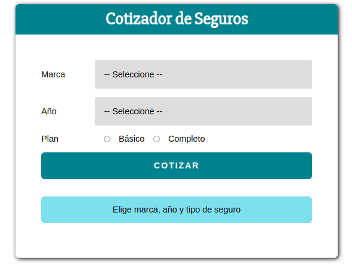

<h1>Cotizador de seguros.</h1>

App focalizada en front end.

Se utilizó ReactJs para su elaboración y librerias como emotion para el uso de "styled components"

Esta app tiene como objetivo realizar el cálculo correspondiente al costo del seguro automovilístico, para ello se solicita al usuario que rellene los campos correspondientes y posteriormente se realizarán los cálculos pertienentes para la obtención del costo del seguro seleccionado.

